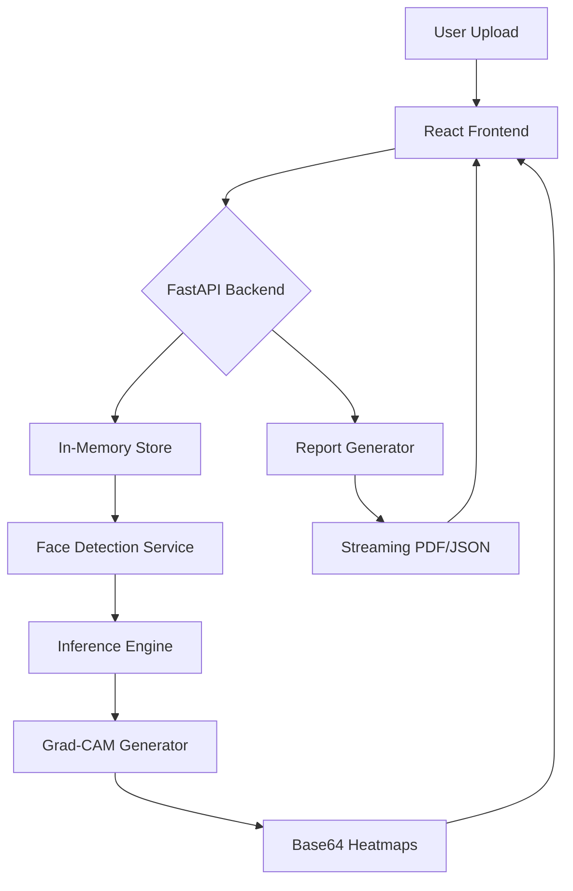

# 🛡️ Deepfake Detector — Multi-Modal Detection System 🔍

### 🚀 Advanced AI-Powered Identification of Manipulated Media

Welcome to the **Deepfake Detector**, a state-of-the-art forensic tool designed to identify and visualize digital manipulations in images and videos. Built with a high-performance **FastAPI** backend and a sleek **React** frontend, this system provides real-time analysis and explainable AI insights.

---

## ✨ Key Features

- **🖼️ Multi-Modal Analysis**: Seamlessly handle both high-resolution images and multi-frame video files.
- **⚡ Fast-API Powered**: Migrated to a modern, asynchronous backend for lightning-fast inference and type safety.
- **💾 0-Disk Footprint**: Advanced in-memory processing ensures your uploads, heatmaps, and reports never touch the local disk.
- **🔥 Grad-CAM Heatmaps**: Explainable AI (XAI) that visually highlights the exact areas of a face suspected of being manipulated.
- **📊 Detailed Reporting**: Generate professional PDF or JSON reports on the fly, complete with frame-by-the-frame probability tables.
- **🟢 Real-Time Status**: Dynamic system monitoring in the UI to ensure the detection engine is always ready.

---

## 🛠️ Technology Stack

| Component | Technology | Description |
| :--- | :--- | :--- |
| **Frontend** | React + Vite | Stunning, responsive dashboard with Tailwind CSS. |
| **Backend** | FastAPI | High-performance Python 3.11+ web framework. |
| **Deep Learning** | PyTorch | EfficientNet-B0 backbone for robust feature extraction. |
| **Computer Vision** | OpenCV | Advanced frame extraction and image processing. |
| **Explainability** | Grad-CAM | Visualizing model decision-making processes. |

---

## 🏗️ Project Architecture



---

## 🚀 Getting Started

### 1️⃣ Clone the Repository
```powershell
git clone https://github.com/your-username/Deepfake-Detector.git
cd Deepfake-Detector
```

### 2️⃣ Setup the Backend
```powershell
cd backend
pip install -r requirements.txt
python app.py
```
> [!TIP]
> The backend runs on `http://localhost:5000`. You can explore the interactive API docs at `/docs`.

### 3️⃣ Setup the Frontend
```powershell
cd ../frontend
npm install
npm run dev
```
> [!NOTE]
> Visit `http://localhost:8080` (or your Vite port) to start detecting!

---

## 📖 How it Works

1. **Upload**: Drop an image or video into the dashboard.
2. **Detection**: The system extracts faces using `facenet-pytorch`.
3. **Analysis**: An **EfficientNet-B0** model, fine-tuned on the **FaceForensics++ (FF++)** dataset, analyzes facial texture and artifacts.
4. **Result**: Get a clear *Real* or *Fake* verdict with a confidence score.
5. **Visualization**: Review top-K manipulated frames highlighted with Grad-CAM heatmaps.

---
